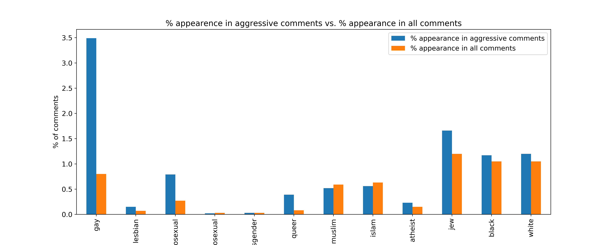
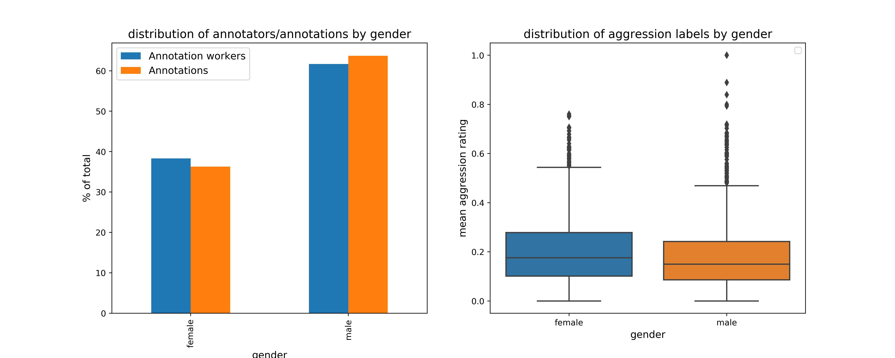
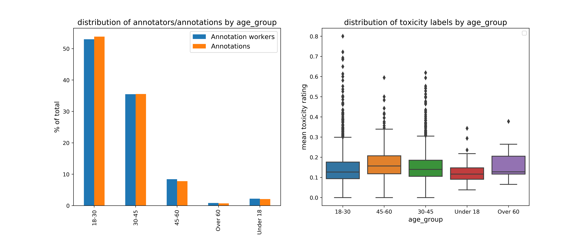

## DATA 512 A2: Bias in data

The goal of this assignment is to identify what, if any, sources of bias that may exist in a corpus of human-annotated data, and to develop testable hypotheses about how these biases might impact the behavior of machine learning models trained on the data, when those models are used for research purposes or to power data-driven applications. 

The corpus that we will use is the Wikipedia Talk corpus that consists of three datasets. Each dataset contains thousands of online discussion posts made by Wikipedia editors who were discussing how to write and edit Wikipedia articles. Crowdworkers labelled these posts for three kinds of hostile speech: **toxicity**, **aggression**, and **personal attacks**. Many posts in each dataset were labelled by multiple crowdworkers for each type of hostile speech, to improve accuracy.

For this assignment, we will performing a set of analysis on the following sets:
* Aggression
* Hostility

### Data sources

* Wikipedia Detox project
  ([Overview](https://meta.wikimedia.org/wiki/Research:Detox),
  [Datasets](https://meta.wikimedia.org/wiki/Research:Detox/Data_Release))
* [Conversation AI](https://conversationai.github.io/)
* Perspective API
  ([Landing page](https://www.perspectiveapi.com/#/home),[Gallery](https://github.com/conversationai/perspectiveapi/wiki/Perspective-Hacks))
* [Aggression](https://figshare.com/articles/dataset/Wikipedia_Talk_Labels_Aggression/4267550)
* [Toxicity](https://figshare.com/articles/dataset/Wikipedia_Talk_Labels_Toxicity/4563973)
* [Personal Attacks](https://figshare.com/articles/dataset/Wikipedia_Talk_Labels_Personal_Attacks/4054689)
* [Wikimedia Foundation REST API terms of use](https://www.mediawiki.org/wiki/Wikimedia_REST_API#Terms_and_conditions)
* Text is available under the [Creative Commons Attribution-ShareAlike License](https://creativecommons.org/licenses/by-sa/3.0/)

### Research questions and the motivation for the analysis

For the assignment, we will be interested in analyzing both aggression and toxicity datasets to answer the following research questions that helps us to understand potential sources of bias, if any
 
1) Is there any unintended bias in the training data with respect to the labelling and distribution of identity terms in the comments? 
* The idea behind this research question is the increasing use of toxic comments and hate speeches across social media and online discussion forums that often contain identity terms based on one's race, religion, gender etc. in a negative connotation targeted against someone, making it difficult to use these terms based on their literal meaning and also to improve the societal awareness. A bias here might result in machine learning models flagging comments with these identity words as a hostile speech which might have adverse implications.

2) How consistent are the labelling behaviours between annotation workers across gender, age and education? 
* The idea behind this question is to understand the distribution of workers based on their gender, age, education etc and how they are related to their labelling behavior of hostile comments. A skew in the distribution towards one particular profile might result in a biased ML model that is trained.

### Exploratory Data Analysis

For the first question, commonly used identity terms were selected (not an exhaustive set) and the following key metrics are calculated
* term_ratio_hostile_flag : % of a particular identity term among all terms found in comments labelled hostile
* term_ratio_overall : % of a particular identity term among all terms found in comments in the entire training data
* term_freq_hostile_flag : Number of occurrences of a particular identity term in comments labelled hostile
* term_freq_overall : Number of occurrences of a particular identity term in the entire training data
* term_hostile_flag_ratio : % of comments with a particular identity term that are labelled hostile

#### Bias analysis in Aggression

| identity     | term_ratio_aggressive | term_ratio_overall | term_freq_aggressive | term_freq_overall | term_aggressive_ratio |
|--------------|-----------------------|--------------------|----------------------|-------------------|-----------------------|
| gay          | 3.49                  | 0.8                | 308                  | 558               | 55.2                  |
| lesbian      | 0.15                  | 0.07               | 13                   | 46                | 28.26                 |
| homosexual   | 0.79                  | 0.27               | 70                   | 185               | 37.84                 |
| heterosexual | 0.02                  | 0.03               | 2                    | 19                | 10.53                 |
| transgender  | 0.03                  | 0.03               | 3                    | 18                | 16.67                 |
| queer        | 0.39                  | 0.08               | 34                   | 53                | 64.15                 |
| muslim       | 0.52                  | 0.59               | 46                   | 412               | 11.17                 |
| islam        | 0.56                  | 0.63               | 49                   | 439               | 11.16                 |
| atheist      | 0.23                  | 0.15               | 20                   | 106               | 18.87                 |
| jew          | 1.66                  | 1.2                | 146                  | 834               | 17.51                 |
| black        | 1.17                  | 1.05               | 103                  | 727               | 14.17                 |
| white        | 1.2                   | 1.05               | 106                  | 733               | 14.46                 |

#### Bias Analysis in Toxicity

| identity     | term_ratio_toxic | term_ratio_overall | term_freq_toxic | term_freq_overall | term_toxic_ratio |
|--------------|------------------|--------------------|-----------------|-------------------|------------------|
| gay          | 3.8              | 0.67               | 351             | 638               | 55.02            |
| lesbian      | 0.16             | 0.05               | 15              | 50                | 30               |
| homosexual   | 0.91             | 0.23               | 84              | 216               | 38.89            |
| heterosexual | 0.02             | 0.03               | 2               | 27                | 7.41             |
| transgender  | 0.04             | 0.03               | 4               | 24                | 16.67            |
| queer        | 0.38             | 0.06               | 35              | 61                | 57.38            |
| muslim       | 0.56             | 0.49               | 52              | 467               | 11.13            |
| islam        | 0.48             | 0.51               | 44              | 491               | 8.96             |
| atheist      | 0.17             | 0.13               | 16              | 121               | 13.22            |
| jew          | 1.72             | 0.95               | 159             | 913               | 17.42            |
| black        | 1.17             | 0.91               | 108             | 871               | 12.4             |
| white        | 1.22             | 0.98               | 113             | 938               | 12.05            |

### Bias Analysis Observations

1) Is there any unintended bias in the training data with respect to the labelling and distribution of identity terms in the comments? 
* As observed in both aggression and toxicity training data, there is a bias in the representation of identity terms in the hostile comments. Comments with terms such as 'gay', 'homosexual' and 'queer' have a high chance of being labelled as toxic or aggressive by the trained ML model. 
* Also the appearance of such terms in the hostile comments are disproportionately high compared to their overall appearance in the training data. This is observed only in select identity groups and not all terms that we considered for our analysis
* A more balanced representation of identity groups in the training data might help train the ML model more effectively (For example by adding more comments with identity terms that convey a positive emotion)

2) How consistent are the labelling behaviours between annotation workers across gender, age and education? 
* It is observed that the distribution is not balanced across the demographic profiles such as gender, age and education. While female group is under-representated in the training data in both toxicity and aggression, their groups also have a higher average scores for toxic and aggressive comments. Similarly, age group 18-30 account for more than 50% of the training data but have a higher tolerance for both toxicity and aggression. There is no obvious bias observed in the education levels, though the possibility of bias cannot be completely ruled out

### Implications

1. Which, if any, of these demo applications would you expect the Perspective API—or any model trained on the Wikipedia Talk corpus—to perform well in? Why?

 * The Perspective API would work well on comments filter and sliders for organizing comments particularly on topics that are difficult to discuss on platforms like Facebook, Twitter, Reddit and Youtube. I like the fact that the tool allows the readers to control the toxicity score so that the reader can go through some meaningful discussions without having to read some toxic comments. Barring the unintended bias it has on select terms, I still think the model would do a fairly good job of filtering out or organizing the comments for majority of the articles. Given the exponential growth of social networks and as a consequence rise in hate speech and abuse, such an utility tool will be really powerful.

5. What are some potential unintended, negative consequences of using the Perspective API for any of these purposes? In your opinion, are these consequences likely or serious enough that you would recommend that the Perspective API not be used in these applications? Why or why not?

 * Based on the analysis, some of the unintended consequences of using the Perspective API might occur when it is used to analyze sensitive articles such as articles around womens rights or LGBTQ rights. For example, the hot topic application, which predicts the toxicity of an unpublished article might have a higher toxicity score for an article discussing LGBTQ rights, when in reality, it may not necessarily be the case and might afeect the release of the article. Having said that, The API would still work well on 90% of the cases and I would ensure that the models are trained on data with as much minimal bias as possible before using it to moderate or analyze all articles.

6. Imagine you are one of the Google data scientists who maintains the Perspective API. If you wanted to improve the model or the API itself to make it work better for any of these purposes, how should they go about doing that?

 * Based on the analysis done so far, one of the major findings from the training data behind Perspective API is the presence of unintended bias in the representation of identity terms. If I were to improve the models powering the Perspective API, I would try to sample a more balanced training data so that the over representation of terms that are not meant to be toxic/aggressive are nullified to an extent. While this might a change in the sampling strategy (stratified sampling to bring a balance), I believe the data will be a better representation of select terms and would be especially useful when the Perspective API is used to moderate articles revolving around civil rights.

### Important Notes

* Aggression for a given comment is derived from the aggression score as follows:
If the aggression score is negative, then the output is 1, else the output is 0
* Toxicity for a given comment is derived from the toxicity score as follows:
If the toxicity score is negative, then the output is 1, else the output is 0
* Aggression/toxicity for a comment is defined as follows:
If the mean aggression/toxicity per comment (based on 10 annotation workers) is greater than 0.5, then that comment is flagged as aggressive/toxic
* For the demographic analysis, the 'other' gender has been excluded citing the lack of data (only one worker observed in both the datasets)

### Licenses:

This project is licensed under the terms of the [MIT license](https://github.com/Pradeepprabhakar92/data-512/blob/main/data-512-a2/LICENSE)

### Dependencies

* numpy
* pandas
* matplotlib
* seaborn
* urllib

